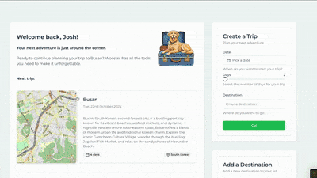

<div align="center">
<h2> Wooster </h2>

## AI-Powered Trip Planning

Leverage AI-generated trip recommendations, explore the world with an interactive 3D globe, and build detailed, personalized itineraries.





## Backend Repository

The backend for this project powers AI recommendations, manages user data, and integrates with external APIs.

### [**Explore the Wooster Backend API and Server**](https://github.com/joshuaisaact/Wooster-server/tree/main#)


</div>

## Table of Contents

- [Overview](#overview)
- [Technologies Used](#technologies-used)
- [Project Structure](#project-structure)
- [Key Features](#key-features)
- [Installation](#installation)
- [Development](#development)
- [Scripts](#scripts)
- [Contributing](#contributing)
- [License](#license)

## Overview

Wooster's frontend provides users with an interactive interface to explore destinations and plan trips. It includes an "Explore" page featuring a 3D globe where users can visualize destinations and trip details. The application fetches data from the Gemini backend via an Express.js API to generate trips and display detailed destination data.

## Technologies Used

Wooster's frontend leverages a modern tech stack for development:

- **TypeScript**: Ensures type safety and scalability.
- **React**: Builds the user interface components.
- **Tailwind CSS**: A utility-first CSS framework for rapid UI development.
- **Leaflet & React-Leaflet**: For map rendering and interactive destination views.
- **Three.js & Globe.gl**: For the 3D globe on the Explore page.
- **Radix UI**: Accessible, unstyled components used for dialogs, sliders, and more.
- **Zod**: Schema validation for user inputs and forms.
- **Vite**: A fast development environment and build tool.

## Project Structure

Below is the core project structure based on the provided files and features:

```plaintext
src/
│
├── components/
│   ├── Activity.tsx                # Activity card component
│   ├── CreateDestination.tsx       # Create Destination card component
│   ├── CreateTrip.tsx              # Create Trip card component
│   ├── DayNav.tsx                  # Navigate between days component
│   ├── DestinationDetail.tsx       # Destination detail card component
│   ├── DayNav.tsx                  # Navigate between days component
│   ├── Dashboard.tsx               # Main dashboard for trip overviews
│   ├── DestinationSummary.tsx      # Component to show destination summaries
│   ├── Map.tsx                     # 2D Map component (using Leaflet.js)
│   ├── SavedDestinations.tsx       # Saved destination list component
│   ├── Sidebar.tsx                 # Sidebar component
│   ├── SidebarNav.tsx              # Sidebar navigation component
│   ├── Trip.tsx                    # Component to show a detailed trip
│   ├── Trips.tsx                   # Main trip page, listing user trips
│   ├── TripCard.tsx                # Trip card component
│   ├── TripsList.tsx               # Component to list all trips
│   ├── AppLayout.tsx               # Layout component for navigation and routing
│   └── reducer.ts                  # State management logic
│
├── pages/
│   ├── AppLayout.tsx              # Top-level page including fetch logic and routes
│   ├── Dashboard.tsx              # Main dashboard
│   ├── DestinationSummary.tsx     # Detailed destination summary page
│   ├── Explore.tsx                # Explore page with 3D globe.
│   ├── Homepage.tsx               # Pre-login page.
│   ├── ItineraryPage.tsx          # Detailed itinerary page for a trip
│   ├── Profile.tsx                # Settings page
│   └── Trip.tsx                   # Trip overview page
│   └── Trips.tsx                  # Trips page
│   └── TripsList.tsx              # List of Trips page
│
│
└── main.tsx                        # Entry point for the React app
```

## Key Features

1. **Explore Destinations**:

   - A 3D interactive globe using `three.js` and `globe.gl`.
   - Leaflet integration for detailed maps and destination exploration.

2. **Trip Planning**:

   - AI-powered trip generation using Gemini.
   - Interactive forms and suggestions powered by React Hook Form and Zod for input validation.

3. **Responsive Design**:

   - Tailwind CSS for dynamic styling and responsive layout.

4. **State Management**:

   - Centralized state management using React's reducer pattern.

5. **Destination Summaries**:

   - Fetch and display detailed summaries for each destination based on AI-generated data.

6. **User Trips**:

   - View planned trips and explore detailed trip itineraries with a focus on user-friendly navigation.

7. **AI art**:

   - Dog art generated using Stable Diffusion.

## Installation

To get started with the Wooster frontend, clone the repository and install the required dependencies:

```bash
git clone https://github.com/yourusername/wooster-frontend.git
cd wooster-frontend
npm install
```

Ensure that you also have the backend service (Gemini) set up for API interaction.

## Development

To start the development server, run:

```bash
npm run dev
```

This will start a Vite-powered development environment with hot module reloading for seamless development.

## Scripts

- `npm run dev`: Start the development server.
- `npm run build`: Build the project for production (TypeScript compilation followed by Vite build).
- `npm run lint`: Lint the code using ESLint.
- `npm run lint:fix`: Automatically fix linting issues.
- `npm run format`: Format the code using Prettier.
- `npm run type-check`: Run TypeScript type checking without emitting any files.
- `npm run vitest`: Run Vitest testing suite
- `npm run vitest:full`: Run the Vitest testing suite in verbose mode, showing all test names (including passing tests).
- `npm run vitest:ui`: Open the Vitest interactive testing UI.
- `npm run test:coverage`: Run the Vitest testing suite with coverage reporting.

## Contributing

Contributions are welcome! If you'd like to improve the app, feel free to submit a pull request or file an issue. Please follow the established coding conventions and make sure all changes are thoroughly tested.

## License

This project is licensed under the MIT License. See the [LICENSE](./LICENSE) file for details.
